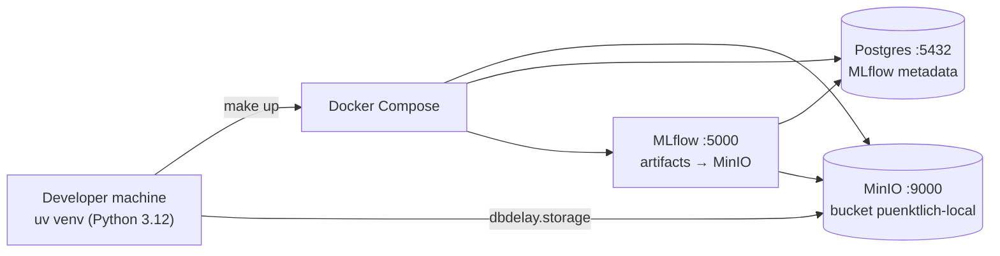

# Phase 0 — Foundations

**Goal:** a clean, reproducible starting point — one Python project, one command to start the local
infrastructure, shared building blocks every later phase uses, and quality checks that run on every commit.

**Status:** ✅ merged into `main` (PR #1, merge commit `e87e440`, 2026-09-24). Branch `phase-0/foundations` is kept.

---

## 1. What was built

| Area | Files | Why it exists |
|---|---|---|
| Python project | `pyproject.toml`, `uv.lock`, `.python-version` | One package (`dbdelay`) managed with **uv**; Python **3.12** to match AWS Lambda. The lock file makes installs identical on every machine. |
| Local infrastructure | `docker-compose.yml`, `docker/mlflow/Dockerfile` | MinIO (S3-compatible storage), Postgres (MLflow's database) and an MLflow server, started with one command. |
| Shared code | `src/dbdelay/config.py`, `errors.py`, `logging.py`, `storage.py` | Settings from `.env`, one exception hierarchy, JSON logging, and an S3/MinIO helper — written once, used by every pipeline, Lambda and test. |
| Commands | `Makefile` | `make setup / up / down / lint / typecheck / test / test-integration / check` — the same commands locally and (later) in CI. |
| Quality gates | `.pre-commit-config.yaml`, ruff + mypy config in `pyproject.toml` | Every commit is linted, formatted, type-checked and scanned for secrets and private keys. |
| Tests | `tests/unit/*`, `tests/integration/test_minio.py` | Unit tests (no network, no Docker) and integration tests against the running MinIO. |
| Hygiene | `.gitignore`, `.dockerignore`, `.editorconfig`, `.env.example`, `LICENSE` | Secrets and data never reach git or images; consistent line endings; MIT licence. |

## 2. How it works



- **Configuration** (`config.py`): a frozen `Settings` object read from environment variables / `.env`.
  Secrets are `SecretStr` (never printed). An empty value in `.env` means "not set". Invalid settings raise
  `ConfigError` with field names only — never values.
- **Storage** (`storage.py`): `make_s3_client()` talks to MinIO locally (endpoint URL set) and to real S3
  in AWS (no endpoint). `ObjectStore` offers `put / get / exists / iter_keys` — deliberately **no delete**,
  so code cannot destroy data by accident.
- **Errors** (`errors.py`): all project errors inherit from `DbDelayError` (`ConfigError`,
  `DataValidationError`, `ExternalServiceError`, `RateLimitedError`, …) so each boundary can catch exactly
  what it expects.
- **Logging** (`logging.py`): AWS Lambda Powertools JSON logger — same format locally and in the cloud.
- All services bind to `127.0.0.1` and store data in Docker **named volumes** (fast on Windows, survive
  `make down`). The official MinIO images were discontinued, so the maintained `pgsty/minio` fork is used,
  pinned to a release tag. The MLflow image's dependencies are locked **with hashes**.

## 3. Key decisions

| Decision | Reason |
|---|---|
| uv instead of pip/poetry | Fast, one lock file, manages the Python version too. |
| Python 3.12 (not 3.13) | Matches the AWS Lambda runtime used later. |
| Repo on the Windows filesystem + Docker named volumes | WSL has no distro installed; named volumes avoid slow Windows bind mounts. |
| No `delete` in `ObjectStore` | Data loss must be impossible outside the planned partition-overwrite logic. |
| AWS account deferred | Not needed until Phase 6 (Terraform). |

## 4. How it was tested

- `make lint` → ruff clean · `make typecheck` → mypy `--strict` clean · `make test` → **30 unit tests pass,
  100 % coverage** · `make test-integration` → **2 integration tests pass** against local MinIO.
- MinIO console (http://localhost:9001) and MLflow UI (http://localhost:5000) reachable after `make up`.
- An independent code review found no blockers; its fixes (empty-env handling, MinIO credential guard,
  hash-locked MLflow image, pinned images, test cleanup) were applied before merge.

## 5. How to run it

```bash
make setup          # uv sync + copy .env.example → .env + install git hooks
make up             # start MinIO, Postgres, MLflow (Docker Desktop must be running)
make check          # lint + typecheck + unit tests
make test-integration
make down           # stop (data volumes are kept)
```

## 6. Known gaps after this phase

- No CI yet (Phase 8) — checks run locally and in pre-commit.
- No AWS resources yet (Phase 6).

## 7. What came next

Phase 1 used this foundation to explore the real data and freeze the data contract →
[phase-1-data-discovery.md](phase-1-data-discovery.md).
