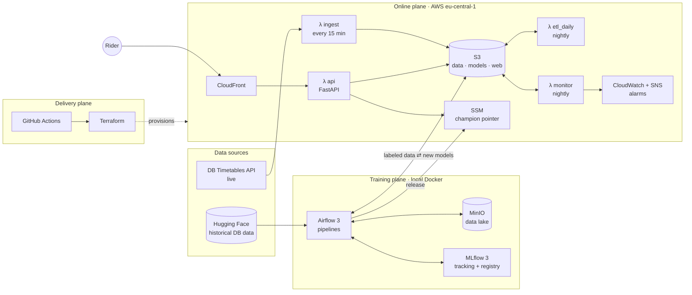
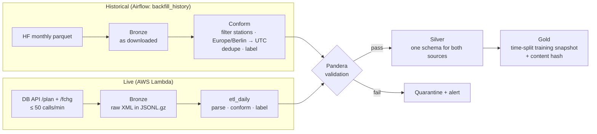
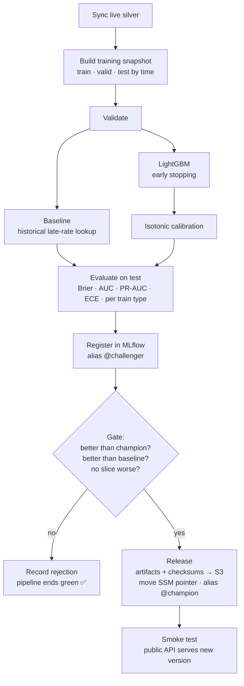
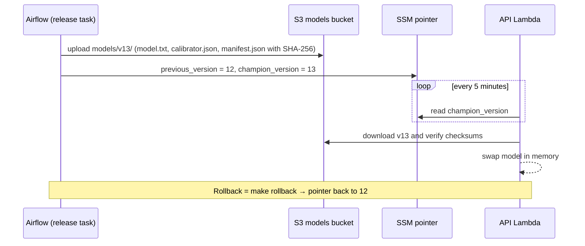
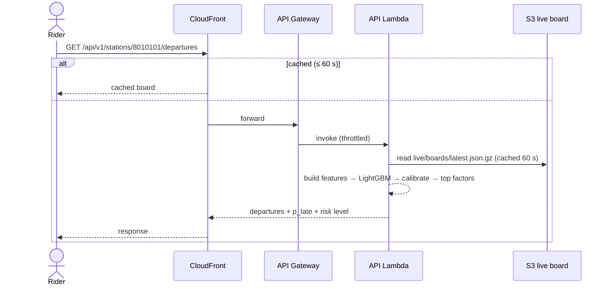
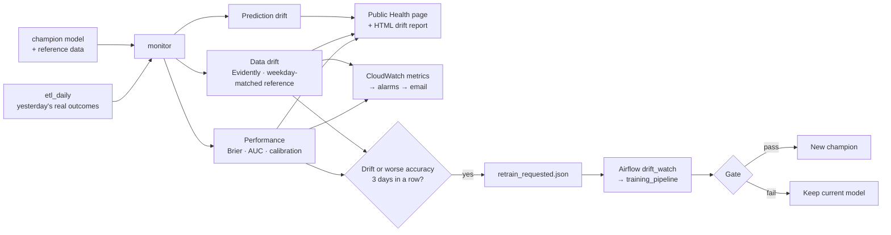
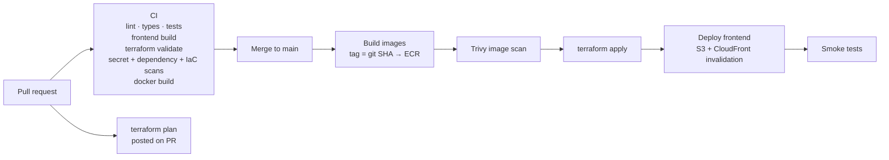
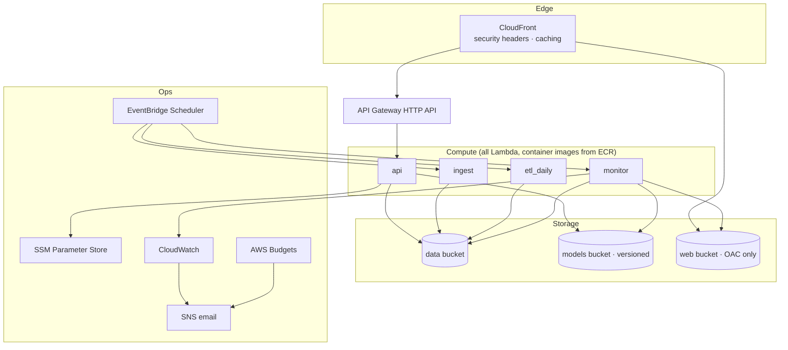

# Pünktlich? 🚆 — Deutsche Bahn Delay Risk, End-to-End MLOps

> **Will my train leave on time?** Pünktlich shows, for upcoming departures at German stations, the probability that the train leaves **6 or more minutes late**. The model is trained on hundreds of millions of historical stop events, monitored every day against what really happened, and retrained automatically when the world changes.

<!-- Replace placeholders once the pieces exist. Never put invented numbers here. -->
[](#) [](#) [](LICENSE)

**🔗 Live demo:** `TBD` · **📈 Model Health:** `TBD/health` · **📘 API docs:** `TBD/api/docs`

<!--  -->

---

## Contents
1. [What this project is](#1-what-this-project-is)
2. [Architecture at a glance](#2-architecture-at-a-glance)
3. [How it works, step by step](#3-how-it-works-step-by-step)
4. [The ML problem](#4-the-ml-problem)
5. [MLOps concepts → where to find them](#5-mlops-concepts--where-to-find-them)
6. [Tech stack](#6-tech-stack)
7. [Security](#7-security)
8. [Cost](#8-cost)
9. [Run it locally](#9-run-it-locally)
10. [Deploy your own](#10-deploy-your-own)
11. [Repository structure](#11-repository-structure)
12. [Limitations and trade-offs](#12-limitations-and-trade-offs)
13. [Documentation](#13-documentation)
14. [Attribution, license, disclaimer](#14-attribution-license-disclaimer)

---

## 1. What this project is

| For riders | For engineers and reviewers |
|---|---|
| Search a station → see departures in the next 3 hours with a **Low / Medium / High** delay-risk badge, the probability, and *why* (top factors). | A complete, production-style **MLOps system**: batch and scheduled ETL, data contracts, experiment tracking, model registry, gated releases, serverless serving, drift monitoring, automatic retraining, CI/CD, and Infrastructure as Code, running on AWS for **under $1/month**. |

**Highlights**
- 📦 **Real data at scale:** ~226 M historical DB stop events (Hugging Face) + live data from the DB Timetables API every 15 minutes.
- 🔁 **Closed loop:** yesterday's real outcomes are used every night to measure the model; drift or a performance drop triggers retraining.
- 🚦 **Gated releases:** a new model only goes live if it beats the current champion *and* a baseline on the same test set. Rejections are normal, recorded outcomes.
- ↩️ **One-command rollback:** models are released by moving a pointer, not by redeploying code.
- 🔍 **Public Model Health page:** accuracy, calibration and drift over time, visible to anyone.
- 🛡️ **Secure by default:** keyless CI (OIDC), least-privilege IAM, scanned images, no pickle, no personal data.

---

## 2. Architecture at a glance

The system has three planes. **Online** runs on AWS serverless services. **Training** runs locally in Docker because managed Airflow costs hundreds of euros per month. **Delivery** is GitHub Actions + Terraform.



---

## 3. How it works, step by step

### 3.1 Data engineering: from raw to features

Data moves through **bronze → silver → gold** layers. Every hop is validated against a schema contract; bad data is quarantined, never silently fixed. Every write overwrites a whole date partition, so re-running a day is safe (idempotent).



- **Label:** `is_late = departure delay ≥ 6 minutes` (DB's own punctuality threshold). Cancelled departures are excluded from the label.
- **No leakage:** features only use what is known from the timetable *before* departure (station, train type, line, stop position, hour, weekday, month, public holiday). Actual delay times can never become features, and a test enforces this.
- **Reconciliation:** for overlapping days, live data is compared with the historical dataset to prove the live ETL produces the same numbers.

### 3.2 Training pipeline, tracking and the promotion gate



Every MLflow run records the **git commit, data snapshot id, config, params, metrics and artifacts**, so any production prediction can be traced back to exactly the code and data that produced its model.

### 3.3 Model release and rollback (no redeploy)



### 3.4 Serving a request



### 3.5 Monitoring and continuous training

Every night the monitor scores **all** of yesterday's departures with the live model and compares them with what really happened. It does this for every departure, not only the ones users asked about, so the measurement isn't biased by traffic.



The **3-day rule** and the weekday-matched reference exist because train data is strongly seasonal. Without them the monitor would raise "drift" every Monday morning.

### 3.6 CI/CD



GitHub authenticates to AWS with **OIDC**, so there are no stored AWS keys. The deploy role only trusts the `production` environment of this repository.

### 3.7 What runs on AWS



All of this is created by Terraform (`infra/`), except a tiny bootstrap for the state bucket and CI roles.

---

## 4. The ML problem

| | |
|---|---|
| **Task** | Binary classification: will this departure be ≥ 6 min late? |
| **Unit** | One departure event (station, ride, planned time) |
| **Features** | Station, train type, line, destination, stop index, local hour, minute of day, weekday, weekend, month, public holiday |
| **Model** | LightGBM (native categoricals) + isotonic calibration |
| **Validation** | Strictly time-based: train → valid → last 14 days as test |
| **Primary metric** | Brier score (accuracy of probabilities) |
| **Also tracked** | ROC-AUC, PR-AUC, log loss, expected calibration error, per-train-type slices |
| **Baseline** | Historical late rate per station × train type × hour × weekday |
| **Explainability** | Per-prediction top factors from LightGBM feature contributions |

**Results** *(filled from MLflow after training; never estimated)*

| Model | Test Brier ↓ | ROC-AUC ↑ | PR-AUC ↑ | ECE ↓ |
|---|---|---|---|---|
| Baseline | TBD | TBD | TBD | TBD |
| LightGBM + calibration | TBD | TBD | TBD | TBD |

See the full [model card](docs/model_card.md).

---

## 5. MLOps concepts → where to find them

| Concept | Implementation | Code |
|---|---|---|
| ETL / ELT, medallion layers | Airflow backfill + Lambda ingestion, bronze/silver/gold | `src/dbdelay/data/`, `pipelines/airflow/dags/` |
| Data contracts & validation | Pandera schemas at every boundary | `src/dbdelay/data/schemas.py` |
| Idempotent pipelines | Partition overwrite, deterministic ids | `src/dbdelay/data/silver.py` |
| Orchestration | Airflow 3 TaskFlow, dynamic mapping, deferrable sensor | `pipelines/airflow/dags/` |
| Feature engineering without leakage | One shared feature module + leakage test | `src/dbdelay/features/` |
| Experiment tracking | MLflow runs with git SHA + data snapshot | `src/dbdelay/training/` |
| Model registry | MLflow aliases `@champion` / `@challenger` | `src/dbdelay/registry/` |
| Gated promotion | Metric + slice gate vs. champion and baseline | `src/dbdelay/training/gate.py` |
| Artifact integrity | SHA-256 manifest, verified on load | `src/dbdelay/registry/artifacts.py` |
| Serving | FastAPI on Lambda, container images | `services/api/` |
| Release & rollback | SSM pointer, `make rollback` | `src/dbdelay/registry/pointer.py` |
| Data / prediction / model drift | Evidently + daily performance on real outcomes | `src/dbdelay/monitoring/` |
| Continuous training | Retrain flag → Airflow sensor → pipeline | `pipelines/airflow/dags/drift_watch.py` |
| Alerting | CloudWatch alarms → SNS email | `infra/modules/observability/` |
| CI/CD | GitHub Actions, OIDC, scans, smoke tests | `.github/workflows/` |
| Infrastructure as Code | Terraform modules, remote state with locking | `infra/` |
| Containerization | Docker (Lambda base images), Compose for local | `services/*/Dockerfile`, `docker-compose.yml` |
| Security | Least-privilege IAM, secrets in SSM, scanning | see [§7](#7-security) |
| Cost control | Serverless only, budgets, lifecycle rules | see [§8](#8-cost) |

---

## 6. Tech stack

| Area | Tools |
|---|---|
| Language | Python 3.12, TypeScript |
| Data | DuckDB, pandas, PyArrow, Pandera |
| ML | LightGBM, scikit-learn |
| MLOps | Apache Airflow 3, MLflow 3, Evidently |
| Serving | FastAPI, Mangum, AWS Lambda, API Gateway |
| Frontend | React, Vite, Tailwind CSS, TanStack Query, Recharts |
| Cloud | AWS: Lambda, S3, CloudFront, EventBridge Scheduler, SSM, CloudWatch, SNS, ECR, Budgets |
| IaC & CI/CD | Terraform, GitHub Actions (OIDC) |
| Quality & security | pytest, moto, Vitest, Ruff, mypy, Trivy, gitleaks, pip-audit, Dependabot |
| Local | Docker Compose, MinIO, Postgres, uv |

---

## 7. Security

- **No long-lived cloud keys:** CI uses GitHub OIDC; the deploy role only trusts the protected `production` environment.
- **Least privilege:** one IAM role per function, scoped to exact bucket prefixes and parameters.
- **Secrets:** DB API credentials live in SSM Parameter Store (encrypted), never in git or logs.
- **Private storage:** all buckets block public access; the website is served only through CloudFront (Origin Access Control) with security headers (HSTS, CSP, …).
- **Abuse protection:** API Gateway throttling, strict input validation, CloudFront caching, budget alarms.
- **Supply chain:** locked dependencies, Dependabot, Trivy image and IaC scans, secret scanning.
- **Safe parsing & artifacts:** XML parsed with `defusedxml`; models stored as LightGBM text + JSON (no pickle) and verified by checksum.
- **Privacy:** no accounts, no tracking, no personal data stored. Fonts are self-hosted.

---

## 8. Cost

Designed for the AWS free tier: serverless only, no always-on servers.

| Service | Monthly |
|---|---|
| Lambda, EventBridge Scheduler, CloudFront, CloudWatch (within always-free limits) | $0 |
| API Gateway, S3, ECR | < $0.50 |
| **Expected total** | **< $1** (hard alarms at $1 and $5) |

Deliberately **not used:** NAT Gateway, load balancers, EC2, RDS, SageMaker endpoints, managed Airflow.

---

## 9. Run it locally

**Prerequisites:** Docker Desktop (or Docker Engine + Compose), `uv`, Node 20+, GNU `make` (Linux/macOS, or Windows via `winget install ezwinports.make`). About 8 GB free RAM for the full stack.

```bash
git clone https://github.com/<you>/puenktlich.git && cd puenktlich
cp .env.example .env          # add your DB API credentials (free at DB API Marketplace)
make setup                    # uv sync + npm ci + pre-commit install
make up                       # MinIO, Postgres, MLflow, Airflow, API, frontend

# In Airflow (http://localhost:8080): run `backfill_history` for a few months,
# then `training_pipeline`.
make seed                     # sample live board for local testing
open http://localhost:5173    # the app
```

| Service | URL |
|---|---|
| Web app | http://localhost:5173 |
| API docs | http://localhost:8000/api/docs |
| Airflow | http://localhost:8080 |
| MLflow | http://localhost:5000 |
| MinIO console | http://localhost:9001 |

Useful commands: `make test`, `make test-integration`, `make lint`, `make typecheck`, `make rollback`, `make down`.
History backfill (Phase 2): `make airflow-env` (once) → `make airflow-up` → `make backfill`; `make test-dags` checks the DAGs.

Training snapshot + baseline (Phase 3): `make baseline` builds `gold/training_sets/<id>/` from the backfilled silver and writes the baseline metrics next to it.

Serving & UI (Phase 5): `make up` → `make seed` (sample live board: a real silver day replayed onto today) → `make app-up` (API on :8000, web app on :5173, compose profile `app`). `make api-dev` runs the API on the host with reload; `make web-check` lints, type-checks and tests the frontend (`npm --prefix frontend ci` once). Without a champion the board still shows departures with "No forecast".

Training (Phase 4): `make train` runs snapshot → LightGBM → calibration → evaluation → MLflow registry → gate → release in one process; `make train-dag` triggers the same steps as the Airflow DAG `training_pipeline`. A promoted model lands in MinIO `models/<version>/` (SHA-256 manifest) and `models/_pointer.json`; `make rollback` swaps the champion back to the previous version.

---

## 10. Deploy your own

1. AWS account with MFA, region `eu-central-1`, budget alert.
2. `cd infra/bootstrap && terraform init && terraform apply`: state bucket + GitHub OIDC roles.
3. Set GitHub repository variables (`AWS_ACCOUNT_ID`, `AWS_REGION`, role ARNs) and create the `production` environment.
4. `scripts/set_secrets.sh`: store DB API credentials in SSM.
5. Merge to `main`: the CD workflow builds, scans, applies Terraform, deploys the frontend and runs smoke tests.
6. Run `training_pipeline` locally with AWS credentials to release the first champion.

Full details: [`docs/architecture.md`](docs/architecture.md) and [`docs/runbook.md`](docs/runbook.md).

---

## 11. Repository structure

```
puenktlich/
├── src/dbdelay/          # shared package: data, features, training, registry, serving, monitoring
├── services/api/         # FastAPI app + Lambda handler + Dockerfile
├── services/jobs/        # ingest, etl_daily, monitor Lambda handlers + Dockerfile
├── pipelines/airflow/    # DAGs: backfill_history, training_pipeline, drift_watch
├── frontend/             # React app
├── infra/                # Terraform: bootstrap, modules, envs/prod
├── configs/              # stations, training, monitoring (YAML)
├── tests/                # unit + integration + fixtures
├── docs/                 # PRD, architecture, rules, phases, design, runbook, ADRs, model card
└── .github/workflows/    # ci, cd, infra-plan
```

---

## 12. Limitations and trade-offs

- **Training runs locally.** Airflow/MLflow on AWS would cost far more than the rest of the system combined. In a company this would run on a managed or Kubernetes-hosted Airflow; the code would not change.
- **v1 uses timetable features only.** Real-time context (e.g. how late trains at this station are right now) would help, but it brings a training/serving skew risk. It's planned as a stretch feature with a parity test.
- **Limited station set** (~30) to respect the free API rate limit.
- **Probabilities, not promises.** Strikes, storms and construction can make any model wrong. That is why the Health page shows live accuracy.
- The DB API free plan has no SLA; gaps are handled and shown as "stale".

---

## 13. Documentation

| Doc | What's inside |
|---|---|
| [`docs/prd.md`](docs/prd.md) | Product requirements: users, features, success metrics |
| [`docs/architecture.md`](docs/architecture.md) | Components, contracts, storage layout, infra, decisions |
| [`docs/rules.md`](docs/rules.md) | Engineering rules and boundaries (also for AI assistants) |
| [`docs/phases.md`](docs/phases.md) | Build plan by phase with exit criteria |
| [`docs/design.md`](docs/design.md) | UI design system |
| `docs/runbook.md` | What to do when an alarm fires |
| `docs/model_card.md` | Current model: data, metrics, limitations |
| `docs/adr/` | Architecture decision records |

---

## 14. Attribution, license, disclaimer

- Timetable and delay data © **Deutsche Bahn AG**, via the DB API Marketplace Timetables API, licensed **CC BY 4.0**.
- Historical data from the Hugging Face dataset [`piebro/deutsche-bahn-data`](https://huggingface.co/datasets/piebro/deutsche-bahn-data) ([GitHub](https://github.com/piebro/deutsche-bahn-data)), CC BY 4.0.
- Code licensed under **MIT**.
- **Pünktlich is an independent student project and is not affiliated with, endorsed by, or connected to Deutsche Bahn AG.** Predictions are estimates. Always check official sources before travelling.

---

<sub>Built by **MD Piyal Ahmmed** · M.Sc. Applied Computer Science, Hochschule Schmalkalden · [GitHub](https://github.com/piyal21) · [LinkedIn](https://linkedin.com/in/md-piyal-ahmmed)</sub>
