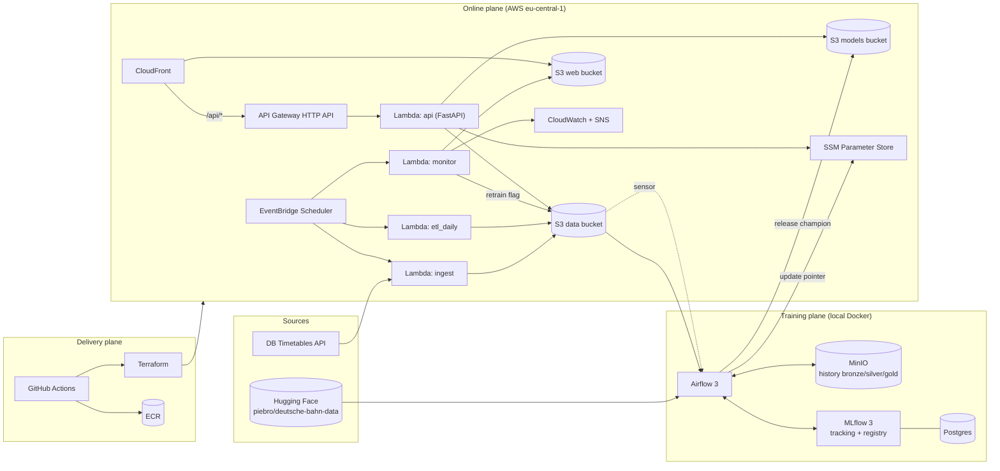
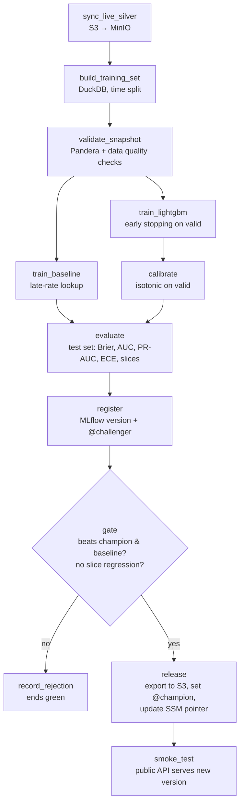
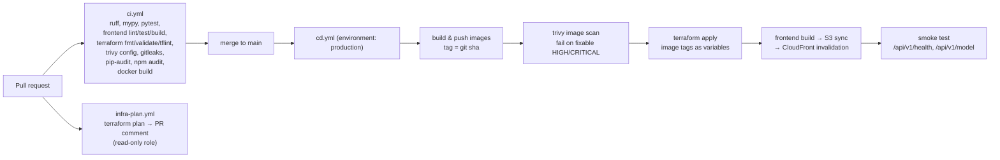

# Architecture — Pünktlich

> **How the system is built.** Read `prd.md` first for the *what* and *why*.
> This document is the technical source of truth: components, data flow, contracts, folder layout, tech stack.
> If code and this document disagree, fix one of them in the same PR.

---

## 1. Big picture

The system has **three planes**:

| Plane | Runs where | Responsibility |
|---|---|---|
| **Online plane** | AWS (serverless) | Live ingestion, serving predictions, the web UI, daily ETL + monitoring |
| **Training plane** | Local machine (Docker Compose) | Historical backfill, feature building, training, experiment tracking, registry, gated release |
| **Delivery plane** | GitHub Actions + Terraform | CI checks, image builds, infrastructure changes, frontend deploys |

The two *release trains* are separate on purpose:
- **Code release** (API/jobs/frontend/infra) → GitHub Actions → Terraform + ECR + S3.
- **Model release** (new champion) → Airflow → S3 model artifacts + SSM pointer. No redeploy needed.



---

## 2. Components

| Component | Tech | Trigger | Reads | Writes |
|---|---|---|---|---|
| `ingest` Lambda (mode `plan`) | Python, `jobs` image | Hourly at :05 | DB `/plan/{eva}/{YYMMDD}/{HH}` for hours H..H+2 | `bronze/…/kind=plan/…`, `live/plans/latest.json.gz` |
| `ingest` Lambda (mode `changes`) | Python, `jobs` image | Every 15 min | DB `/fchg/{eva}`, `live/plans/latest.json.gz` | `bronze/…/kind=fchg/…`, `live/boards/latest.json.gz` |
| `etl_daily` Lambda | Python, `jobs` image | Daily 03:30 Europe/Berlin | Bronze of D-1 | `silver/departures/source=live/date=D-1/` |
| `monitor` Lambda | Python + Evidently, `jobs` image | Daily 04:30 Europe/Berlin | Silver D-1, champion artifacts | `public/health/*`, `public/reports/*`, CloudWatch metrics, `control/retrain_requested.json` |
| `api` Lambda | FastAPI + Mangum, `api` image | HTTP via API Gateway | `live/boards/latest.json.gz`, champion artifacts, SSM pointer | CloudWatch Logs (prediction log) |
| Frontend | React SPA | CloudFront | `/api/v1/*`, `/health/*.json` | — |
| Airflow `backfill_history` | Airflow 3 (local) | Manual | Hugging Face monthly parquet | MinIO bronze/silver |
| Airflow `training_pipeline` | Airflow 3 (local) | Monthly + triggered | MinIO silver (hf) + S3 silver (live) | MinIO gold, MLflow, S3 models, SSM |
| Airflow `drift_watch` | Airflow 3 (local) | Sensor on S3 flag | `control/retrain_requested.json` | Triggers `training_pipeline` |
| MLflow | MLflow 3 server (local) | — | Postgres, MinIO | — |

**Two container images** keep builds simple:
- `puenktlich/api` — slim: FastAPI, Mangum, LightGBM, numpy, boto3, shared `dbdelay` package.
- `puenktlich/jobs` — ingest/etl_daily/monitor share one image; each Lambda sets its own handler via `image_config.command`. Contains DuckDB, pandas, pyarrow, Evidently.

Both are built for `linux/amd64` (Lambda architecture `x86_64`) from `public.ecr.aws/lambda/python:3.12`.

---

## 3. Data flow and storage layout

### 3.1 Medallion layers

| Layer | Meaning | Format | Where |
|---|---|---|---|
| Bronze | Raw, immutable, as received | HF: parquet as downloaded · Live: JSONL.gz (one line per station call, raw XML inside) | Local MinIO (HF) · S3 data bucket (live) |
| Silver | Cleaned, deduplicated, conformed to one schema, UTC timestamps, labeled | Parquet, partitioned by `source` and `date` | MinIO (`source=hf`) · S3 (`source=live`) |
| Gold | Feature-ready training snapshots | Parquet, one folder per snapshot id | MinIO only |

History stays **local** (MinIO) to respect the S3 free-tier storage budget. AWS holds only live data (small) plus models and the website.

### 3.2 Buckets and prefixes

`<acct>` = AWS account id suffix to make names unique.

```
s3://puenktlich-data-<acct>/                (private, SSE-S3, versioning off, lifecycle rules)
├── bronze/timetables/kind=plan/date=YYYY-MM-DD/run=<ISO-ts>.jsonl.gz     # expire after 30 days
├── bronze/timetables/kind=fchg/date=YYYY-MM-DD/run=<ISO-ts>.jsonl.gz     # expire after 30 days
├── live/plans/latest.json.gz                                             # overwritten hourly
├── live/boards/latest.json.gz                                            # overwritten every 15 min
├── silver/departures/source=live/date=YYYY-MM-DD/part-0.parquet          # kept
└── control/
    ├── retrain_requested.json                                            # written by monitor
    └── history/<ISO-ts>-retrain_requested.json                           # archived by drift_watch

s3://puenktlich-models-<acct>/              (private, SSE-S3, versioning ON)
└── models/<version>/
    ├── manifest.json
    ├── model.txt                 # LightGBM native text format (no pickle)
    ├── calibrator.json           # isotonic thresholds (x, y arrays)
    ├── feature_spec.json         # feature names, dtypes, category levels, risk thresholds
    ├── metrics.json
    ├── model_card.md
    └── reference_sample.parquet  # ≤ 50k rows from training data, for drift reference

s3://puenktlich-web-<acct>/                 (private; only CloudFront OAC can read)
├── index.html, assets/…                    # frontend build
└── public/
    ├── health/latest.json                  # current health snapshot
    ├── health/history.json                 # last 90 days of daily metrics
    └── reports/YYYY-MM-DD.html             # Evidently drift report
```

Local MinIO mirrors the same layout in bucket `puenktlich-local`, plus the history layers written by `backfill_history` (Phase 2):

```
bronze/hf/month=YYYY-MM/data.parquet                         # HF monthly file, byte-identical
bronze/hf/month=YYYY-MM/_manifest.json                       # hf_revision, sha256, size, downloaded_at (= silver ingested_at)
silver/departures/source=hf/date=YYYY-MM-DD/part-0.parquet   # one file per UTC day, every day of a built month (empty allowed)
silver/_quarantine/source=hf/month=YYYY-MM/part-0.parquet    # rejected rows + quarantine_reason
silver/_quality/source=hf/month=YYYY-MM.json                 # quality report (rows, drops, quarantine, rates, flags, content hash)
gold/training_sets/<snapshot_id>/…                           # Phase 3–4
```

### 3.3 Silver contract — `silver/departures` (schema version 1)

Both sources (HF and live) **must** produce exactly this schema. Enforced by `dbdelay.data.schemas.SilverDepartures` (Pandera).

| Column | Type | Nullable | Notes |
|---|---|---|---|
| `event_id` | string | no | Primary key: lowercase hex SHA-1 of the UTF-8 string `f"{eva}\|{ride_id}\|{planned_departure_utc:%Y-%m-%dT%H:%MZ}"` (identical in both ETLs) |
| `eva` | string | no | Station EVA number in API form: 7 digits, no leading zero (HF `08000105` → `8000105`) |
| `station_name` | string | no | |
| `ride_id` | string | no | `s@id` without its stop suffix: `<trip hash>-<YYMMDDHHmm trip start>`. HF: `id` minus suffix (HF `train_line_ride_id` is only the hash and repeats across days) |
| `stop_index` | int16 | no | Position of the station within the ride, ≥ 1 (= `s@id` suffix = HF `train_line_station_num`) |
| `train_type` | string | no | Category `tl@c` uppercased: ICE, IC, RE, RB, S, operator codes (VIA, HLB, …) |
| `train_number` | string | yes | |
| `line_number` | string | yes | |
| `final_destination` | string | yes | |
| `planned_departure_utc` | timestamp[us, UTC] | no | Rows without a planned departure (terminating trains) are dropped |
| `changed_departure_utc` | timestamp[us, UTC] | yes | Last known changed time; no change reported ⇒ = planned (ADR 0001) |
| `delay_min` | Int16 | yes | `changed − planned` in minutes; 0 if no change reported; null if cancelled |
| `is_cancelled` | bool | no | Departure cancelled |
| `is_late` | boolean | yes | `delay_min >= 6`; **null when cancelled** (ADR 0001) |
| `source` | string | no | `hf` or `live` |
| `ingested_at` | timestamp[us, UTC] | no | |

Rules:
- HF timestamps (and live `pt`/`ct`) are naive **Europe/Berlin** local time → localize with `ambiguous="NaT"`, `nonexistent="NaT"`, drop + count those rows, then convert to UTC. (`infer` is unreliable on a flat frame — see EDA §6.)
- Contract checks (Pandera, no coercion): cancelled ⇒ `delay_min` and `is_late` null; not cancelled ⇒ `changed_departure_utc` set, `delay_min == changed − planned` (minutes) and `is_late == (delay_min >= 6)`.
- HF conform maps retired EVAs listed under `hf_aliases` in `configs/stations.yaml` onto the station's current EVA (e.g. Berlin Hbf 8011160 → 8098160).
- Partition by the UTC date of `planned_departure_utc`. HF month files overlap at their edges → deduplicate on `event_id` across files, keep the row with the latest `ingested_at`.
- Writes overwrite a whole `date=` partition → re-running a day is idempotent.

### 3.4 Gold — training snapshot

`gold/training_sets/<snapshot_id>/{train,valid,test}.parquet` + `snapshot.json` (window dates, row counts, late rate, silver partitions used, rows excluded — cancelled / data-gap hours / data-gap station-days — content hash).
Rows are labelled silver rows only (cancelled rows have no label); flagged data gaps from the monthly quality reports are excluded when `exclude_data_gaps: true` (`configs/training.yaml`).
Phase 3 writes the baseline next to it: `baseline/{feature_spec.json, baseline.json, metrics.json}` (`make baseline`).
`snapshot_id = <end-date>_<first 8 chars of content hash>`. Logged to MLflow with `mlflow.log_input`.

---

## 4. Features

Single source of truth: `src/dbdelay/features/build.py::build_features(df, spec) -> pd.DataFrame`.
Used by **training, API and monitor** — never re-implemented elsewhere (prevents training/serving skew).

### v1 feature set (all known from the timetable in advance → no leakage)

| Feature | Type | Derivation |
|---|---|---|
| `eva` | categorical | Station |
| `train_type` | categorical | ICE/IC/EC/RE/RB/S/other |
| `line_key` | categorical | `"<train_type>:<line_number>"` (missing line → `"<train_type>:none"`); levels with < `min_count` rows → `OTHER` |
| `destination_key` | categorical | `final_destination`, rare levels → `OTHER` |
| `stop_index` | int | Delay accumulates along a ride |
| `hour_local` | int | Europe/Berlin hour of planned departure |
| `minute_of_day` | int | |
| `weekday` | int | 0 = Monday |
| `is_weekend` | bool | |
| `month` | int | Seasonality |
| `is_public_holiday` | bool | `holidays` library, Germany national + station's state |

Category levels are frozen in `feature_spec.json` at training time; unknown levels at inference map to `OTHER`.

### v2 (stretch) live-context features
`station_late_share_prev_2h` computed **as of `planned_departure − 60 min`** in training, and from `live/boards` history at serving. Requires a parity test (`tests/integration/test_feature_parity.py`) before enabling.

---

## 5. Training pipeline (Airflow)

### 5.1 DAGs

| DAG | Schedule | Purpose |
|---|---|---|
| `backfill_history` | Manual (params: months) | Download HF monthly parquet → bronze → silver (per month, dynamic task mapping) |
| `training_pipeline` | `@monthly` + triggered | Build snapshot → baseline → train → calibrate → evaluate → register → gate → release → smoke test |
| `drift_watch` | Every 30 min (deferrable S3 sensor) | Detect `control/retrain_requested.json` → trigger `training_pipeline` → archive flag |

### 5.2 `training_pipeline` steps



### 5.3 Split and evaluation
- Window: last `training.window_months` (default 9) of silver.
- `test` = last 14 days, `valid` = 14 days before test, `train` = everything earlier. No shuffling.
- The **champion is re-evaluated on the same test set** as the challenger for a fair comparison.

### 5.4 Promotion gate (`configs/training.yaml`)
```yaml
gate:
  min_brier_improvement_vs_baseline: 0.05   # relative
  max_brier_regression_vs_champion: 0.00    # challenger must be <= champion
  max_auc_drop_vs_champion: 0.005
  max_slice_auc_drop: 0.02                  # per train_type
  min_test_rows: 20000
```
If there is no champion yet (first run), only the baseline and slice checks apply.

---

## 6. Model artifact contract

`models/<version>/manifest.json`:
```json
{
  "schema_version": 1,
  "model_name": "puenktlich-delay",
  "version": "12",
  "mlflow_run_id": "3f2c…",
  "git_sha": "a1b2c3d",
  "data_snapshot_id": "2026-09-20_9ac31e7f",
  "trained_at": "2026-09-21T02:14:09Z",
  "train_window": { "start": "2025-12-01", "end": "2026-09-06" },
  "files": {
    "model.txt": "sha256:…",
    "calibrator.json": "sha256:…",
    "feature_spec.json": "sha256:…",
    "reference_sample.parquet": "sha256:…"
  },
  "metrics": { "test_brier": 0.0, "test_auc": 0.0, "baseline_brier": 0.0 }
}
```
Loaders **must** verify every checksum and fail closed on mismatch.

### Release & rollback
- SSM `/puenktlich/prod/model/champion_version` = live version. `/…/previous_version` = the one before.
- Release: upload artifacts → verify → write `previous_version` ← current → write `champion_version` ← new → set MLflow alias `@champion`.
- API and monitor re-read the pointer every **5 minutes** (TTL cache) → new model live without redeploy.
- Rollback: `make rollback` swaps the pointer back to `previous_version` and moves the MLflow alias.
- Terraform creates the SSM parameters but uses `lifecycle { ignore_changes = [value] }` so model releases don't cause drift.

---

## 7. Serving

- **Runtime:** FastAPI app wrapped by Mangum, on Lambda (container image, 1024 MB, timeout 15 s).
- **Entry:** CloudFront `/api/*` → API Gateway HTTP API (`$default` stage) → Lambda. Same origin as the frontend → no CORS needed in production (CORS allowed only for `http://localhost:5173` in dev).
- **Model loading:** on cold start, read SSM pointer → download artifacts to `/tmp/models/<version>/` → verify checksums → load LightGBM booster + calibrator. Cached in module scope.
- **Board:** read `live/boards/latest.json.gz` (cache 60 s in memory) → filter station and next N hours → build features → batch predict → attach risk level. CloudFront caches board responses for 60 s.
- **Explanations:** `booster.predict(X, pred_contrib=True)` → top 3 features by absolute contribution → mapped to human text in `dbdelay/serving/explain.py`.
- **Prediction log:** one structured JSON log line per scored departure (`event_id`, `model_version`, `p_late`, `latency_ms`, `request_id`) → CloudWatch Logs (retention 14 days).

### API contract (v1)

`GET /api/v1/stations/{eva}/departures?hours=3`
```json
{
  "station": { "eva": "8010101", "name": "Erfurt Hbf" },
  "data_as_of": "2026-09-24T15:30:12Z",
  "stale": false,
  "model_version": "12",
  "departures": [
    {
      "event_id": "5b1e…",
      "planned_departure": "2026-09-24T17:42:00+02:00",
      "live_departure": "2026-09-24T17:45:00+02:00",
      "live_delay_min": 3,
      "cancelled": false,
      "platform": "3",
      "train": { "type": "RE", "number": "4711", "line": "RE1", "destination": "Göttingen" },
      "prediction": { "p_late": 0.37, "risk_level": "medium" }
    }
  ]
}
```

`POST /api/v1/predict`
```json
// request
{ "eva": "8010101", "train_type": "ICE", "train_number": "1602", "line_number": null,
  "final_destination": "Berlin Hbf", "stop_index": 7, "planned_departure": "2026-09-25T08:10:00+02:00" }
// response
{ "p_late": 0.41, "risk_level": "medium", "model_version": "12",
  "top_factors": [
    { "feature": "stop_index", "direction": "up", "text": "Late stop in a long journey" },
    { "feature": "weekday", "direction": "up", "text": "Fridays are busier" },
    { "feature": "hour_local", "direction": "down", "text": "Morning departures are usually punctual here" }
  ] }
```

Errors → `application/problem+json`:
```json
{ "type": "/errors/station-not-supported", "title": "Station not supported", "status": 404,
  "detail": "EVA 123 is not in the supported station list.", "instance": "/api/v1/stations/123/departures",
  "request_id": "c0ffee…" }
```

Other endpoints: `GET /api/v1/health`, `GET /api/v1/stations?q=`, `GET /api/v1/model`. OpenAPI at `/api/docs`.

---

## 8. Live ingestion (DB Timetables API)

- Base URL: `https://apis.deutschebahn.com/db-api-marketplace/apis/timetables/v1`
- Endpoints used: `GET /plan/{evaNo}/{YYMMDD}/{HH}`, `GET /fchg/{evaNo}`, `GET /station/{pattern}` (setup only).
- Headers: `DB-Client-Id`, `DB-Api-Key`, `Accept: application/xml`. Credentials in SSM SecureString.
- Response: XML (`timetable > s` elements; `ar`/`dp` children with `pt` = planned time, `ct` = changed time, format `YYMMDDHHmm`; `tl` = train info; `pp` = platform). Parse with **`defusedxml`** only.
- Limit: free plan = **60 calls/min** → client-side limiter at **50 calls/min**, retries with exponential backoff + jitter on 429/5xx (max 3), per-station failure is logged and skipped (partial success is OK; the run reports counts).
- Budget per run (30 stations): `changes` = 30 calls (~40 s) · `plan` = 90 calls (~2 min). Lambda timeout 5 min.
- Each run writes **one** bronze object (JSONL.gz, one line per station call incl. HTTP status) → few S3 PUTs.

---

## 9. Monitoring and continuous training

Daily `monitor` Lambda (04:30, after `etl_daily`):
1. Load champion artifacts (same loader as API).
2. Read silver D-1 → build features → **batch score all of yesterday's departures** (shadow evaluation, independent of user traffic).
3. **Model performance:** Brier, AUC, log loss, ECE on yesterday's real outcomes.
4. **Data drift:** Evidently `Report([DataDriftPreset()])` — current = D-1 features, reference = `reference_sample.parquet` filtered to the same weekday type (weekday vs weekend) to reduce seasonal false alarms.
5. **Prediction drift:** distribution of `p_late` vs. reference predictions.
6. Publish: HTML report → `public/reports/`, JSON → `public/health/latest.json` + append `history.json`.
7. Emit CloudWatch metrics (namespace `Puenktlich`): `DriftShare`, `BrierDaily`, `AUCDaily`, `LabeledEvents`.
8. Evaluate triggers (`configs/monitoring.yaml`):
   - `DriftShare > 0.30` for **3 consecutive days**, or
   - `BrierDaily > champion test_brier × 1.10` for 3 consecutive days
   → write `control/retrain_requested.json` `{reason, metrics, requested_at}`.

`ingest` emits `EventsIngested` per run.

### Alarms (CloudWatch → SNS email)
| Alarm | Condition |
|---|---|
| Ingestion stopped | `EventsIngested` sum = 0 over 60 min (missing data = breaching) |
| Ingest errors | Lambda `Errors` > 0 for 2 consecutive runs |
| API errors | API Gateway `5xx` > 5 in 5 min |
| API throttling | Lambda `Throttles` > 0 |
| Monitor missing | `LabeledEvents` missing for 26 h |
| Drift | `DriftShare` > 0.30 |
| Performance | `BrierDaily` above threshold |
| Budget | AWS Budgets: actual > $1 and forecast > $5 |

Keep **≤ 10 custom metrics** and **≤ 10 alarms** (free-tier limits).

---

## 10. CI/CD



- **Auth:** GitHub OIDC → two IAM roles created in `infra/bootstrap`:
  - `puenktlich-gh-plan` — read-only, trusted for `pull_request` on this repo.
  - `puenktlich-gh-deploy` — deploy permissions, trusted only for `repo:<owner>/puenktlich:environment:production`.
- **Branch protection:** `main` requires CI to pass; no direct pushes.
- **Images:** immutable tags (git SHA); ECR lifecycle keeps the last 10 images per repo; scan on push enabled.
- Model releases are **not** part of CD (see §6).

---

## 11. Infrastructure as code

```
infra/
├── bootstrap/          # applied once, locally, with local state
│   └── main.tf         # tf-state bucket, GitHub OIDC provider, gh-plan & gh-deploy roles
├── modules/
│   ├── data_lake/      # data + models buckets, lifecycle, encryption, public access block
│   ├── ecr/            # api & jobs repos, lifecycle, scan on push
│   ├── lambda_image/   # generic container Lambda + role + log group (retention)
│   ├── http_api/       # API Gateway HTTP API, throttling, access logs
│   ├── schedules/      # EventBridge Scheduler schedules (timezone Europe/Berlin)
│   ├── web_cdn/        # web bucket, CloudFront (OAC), /api/* behavior, security headers
│   ├── ssm/            # parameters (pointer ignore_changes; secrets created empty)
│   ├── observability/  # SNS topic + email subscription, alarms, dashboard
│   └── budget/         # AWS Budgets with email alerts
└── envs/
    └── prod/
        ├── backend.tf      # s3 backend, use_lockfile = true
        ├── main.tf         # wires modules together
        ├── variables.tf    # image tags, alert email, station count …
        ├── outputs.tf      # cloudfront domain, api url, bucket names
        └── terraform.tfvars
```

- Terraform `>= 1.10`, AWS provider `~> 6.0`, S3 backend with **native lockfile** (no DynamoDB lock table).
- Default tags on every resource: `project=puenktlich`, `env=prod`, `managed_by=terraform`, `owner=<you>`.
- Secret *values* (DB API keys, alert email) are **never** in `.tfvars`; secrets are set once with the AWS CLI.

---

## 12. Security architecture

| Area | Control |
|---|---|
| Identity | Root account MFA; daily work via IAM Identity Center user; no long-lived keys in CI (OIDC) |
| Least privilege | One IAM role per Lambda, scoped to exact bucket prefixes and parameters; no `*` actions/resources |
| Secrets | SSM SecureString; read at cold start; never logged |
| Storage | All buckets: Block Public Access, SSE-S3, TLS-only bucket policy; web bucket readable only via CloudFront OAC |
| Edge | CloudFront security headers policy (HSTS, CSP, X-Content-Type-Options, Referrer-Policy, frame-ancestors none) |
| API abuse | API Gateway throttling (rate 10 req/s, burst 20); `hours` capped at 6; request body size limit; Pydantic validation |
| Cost abuse | CloudFront caching for board responses; budget alarms; optional Lambda reserved concurrency when the account quota allows |
| Supply chain | Pinned deps (`uv.lock`, `package-lock.json`); pip-audit/npm audit; Trivy image + config scans; Dependabot |
| Code | Ruff `S` (bandit) rules; gitleaks; no `eval`, no `pickle` for artifacts; `defusedxml` for XML |
| Model integrity | SHA-256 checksums in manifest, verified before load; models bucket versioned |
| Privacy | No accounts, no cookies beyond essentials, no personal data; access logs have short retention |

---

## 13. Environments and configuration

| Setting | Local (`.env`) | AWS (Lambda env / SSM) |
|---|---|---|
| `APP_ENV` | `local` | `prod` |
| `STORAGE_ENDPOINT_URL` | `http://minio:9000` | *(unset → AWS S3)* |
| `DATA_BUCKET` / `MODELS_BUCKET` / `WEB_BUCKET` | `puenktlich-local` | Terraform outputs |
| `MODEL_POINTER_PARAM` | local file `.local/champion_version` | `/puenktlich/prod/model/champion_version` |
| `DB_API_CLIENT_ID` / `DB_API_KEY` | `.env` (git-ignored) | SSM SecureString |
| `MLFLOW_TRACKING_URI` | `http://mlflow:5000` | — |

Configuration is loaded via `pydantic-settings` in `src/dbdelay/config.py`. YAML configs in `configs/` hold non-secret tunables (stations, training, monitoring).

---

## 14. Repository layout

```
puenktlich/
├── README.md
├── CLAUDE.md                       # short pointer for Claude Code → docs/
├── Makefile                        # make up / down / test / lint / train / rollback …
├── pyproject.toml                  # uv-managed; package `dbdelay` in src/
├── uv.lock
├── docker-compose.yml              # minio, postgres, mlflow, airflow, api, frontend
├── docker/mlflow/Dockerfile        # MLflow server image (+ psycopg2, boto3)
├── .env.example
├── .pre-commit-config.yaml
├── .github/
│   ├── workflows/ ci.yml  cd.yml  infra-plan.yml
│   └── dependabot.yml
├── docs/
│   ├── prd.md  architecture.md  rules.md  phases.md  design.md
│   ├── model_card.md               # generated/updated at release
│   ├── runbook.md                  # alarms → what to do
│   └── adr/                        # 0001-serverless-serving.md …
├── configs/
│   ├── stations.yaml               # supported stations (eva, name, state, optional hf_aliases)
│   ├── training.yaml               # window, params, gate thresholds
│   └── monitoring.yaml             # drift/perf thresholds, trigger rules
├── src/dbdelay/                    # shared Python package (used everywhere)
│   ├── config.py
│   ├── logging.py
│   ├── errors.py                   # exception hierarchy
│   ├── storage.py                  # S3/MinIO helpers (boto3 + endpoint override)
│   ├── timetables/  client.py  parser.py  ratelimit.py
│   ├── data/  schemas.py  hf_backfill.py  silver.py  quality.py
│   ├── features/  build.py  spec.py  calendar.py
│   ├── training/  split.py  baseline.py  train.py  calibrate.py  evaluate.py  gate.py
│   ├── registry/  artifacts.py  release.py  pointer.py
│   ├── serving/  model_loader.py  board.py  explain.py
│   └── monitoring/  drift.py  performance.py  publish.py  triggers.py
├── services/
│   ├── api/
│   │   ├── app/  main.py  routers/  schemas.py  deps.py  errors.py
│   │   ├── lambda_handler.py       # Mangum
│   │   └── Dockerfile
│   └── jobs/
│       ├── handlers/  ingest.py  etl_daily.py  monitor.py
│       └── Dockerfile
├── pipelines/airflow/
│   ├── dags/  backfill_history.py  training_pipeline.py  drift_watch.py
│   ├── init/create_db.py           # creates the `airflow` DB in the shared Postgres
│   ├── tests/check_dags.py         # DAG import/shape check (`make test-dags`)
│   └── Dockerfile                  # apache/airflow:3.3.2 + `dbdelay[pipelines]` (Airflow constraints)
├── frontend/
│   ├── src/  pages/  components/  api/  hooks/  styles/  lib/
│   ├── index.html  vite.config.ts  package.json  tsconfig.json
├── infra/                          # see §11
├── Phases/                        # one plain-language explainer per finished phase + README index
├── notebooks/  01_eda.ipynb        # exploration only; logic moves to src/
├── scripts/  seed_sample_data.py  rollback.py  set_secrets.sh
└── tests/
    ├── unit/                       # fast, no network, no Docker
    ├── integration/                # MinIO/MLflow via compose, marked `integration`
    └── fixtures/  sample_plan.xml  sample_fchg.xml  silver_sample.parquet
```

---

## 15. Tech stack

| Layer | Choice | Why |
|---|---|---|
| Language | Python 3.12, TypeScript 5 | Lambda-supported, typed |
| Packaging | uv (+ `uv.lock`) | Fast, reproducible |
| Data processing | DuckDB, pandas 2, PyArrow | DuckDB handles large parquet on a laptop; pandas for model I/O |
| Validation | Pandera (dataframes), Pydantic v2 (API/config) | Contracts at every boundary |
| ML | LightGBM 4, scikit-learn (metrics, isotonic) | Strong on tabular, CPU-friendly, native categorical support |
| Orchestration | Apache Airflow 3 (TaskFlow, `airflow.sdk`) | Industry standard, asked for in job ads |
| Tracking/registry | MLflow 3 (Postgres + MinIO) | Tracking, registry, aliases |
| Monitoring | Evidently (≥ 0.7 API: `from evidently import Report`, `from evidently.presets import DataDriftPreset`) | Drift reports |
| API | FastAPI + Mangum | Typed, OpenAPI, runs on Lambda |
| HTTP client | httpx + tenacity | Timeouts, retries with backoff |
| XML | defusedxml | Safe XML parsing |
| Logging | AWS Lambda Powertools Logger (JSON) | Structured logs, request ids |
| Frontend | React 19, Vite, Tailwind CSS v4, TanStack Query, React Router, Recharts, lucide-react | Fast, typed, mobile-first |
| Tests | pytest, moto (AWS mocks), Vitest, Testing Library | |
| Containers | Docker, Docker Compose | Local parity, Lambda images |
| Local object store | MinIO via `pgsty/minio` (community fork; official `minio/minio` images are no longer published) | S3-compatible, same API as AWS S3 |
| Cloud | AWS: Lambda, API Gateway (HTTP), S3, CloudFront, EventBridge Scheduler, SSM, CloudWatch, SNS, ECR, Budgets | Serverless = free-tier friendly |
| IaC | Terraform ≥ 1.10, tflint | |
| CI/CD | GitHub Actions, OIDC | |
| Security | Trivy, gitleaks, pip-audit, npm audit, Ruff `S` rules, Dependabot | |

---

## 16. Cost map (steady state, demo traffic)

| Service | Expected usage | Cost |
|---|---|---|
| Lambda | ~150k GB-s/month (ingest + jobs + api) | $0 (always-free 400k GB-s) |
| API Gateway HTTP | < 100k requests | ~$0.10 |
| S3 | < 2 GB, ~5k PUTs/month | < $0.10 |
| CloudFront | < 1 GB | $0 (always free 1 TB) |
| EventBridge Scheduler | ~4k invocations | $0 (14M free) |
| CloudWatch | ≤ 10 metrics, ≤ 10 alarms, logs < 1 GB | $0 |
| ECR | ~1.5 GB images | ~$0.15 |
| SSM Standard params | 5 params | $0 |
| **Total** | | **≈ $0.50 / month** |

**Never create:** NAT Gateway, ALB/NLB, EC2, RDS, MWAA, SageMaker endpoints, Elastic IPs, VPC-attached Lambdas.

---

## 17. Failure modes

| Failure | Detection | Behaviour |
|---|---|---|
| DB API down / 429 | Ingest error counts, `EventsIngested` alarm | Retries; board keeps last data, marked `stale` after 20 min |
| Bad data (schema change) | Pandera validation fails | Pipeline stops, partition not written, alarm/Airflow failure |
| Model artifact corrupt | Checksum mismatch | Loader refuses; API keeps previous in-memory model or returns 503 with problem+json |
| No champion yet | Pointer missing | API returns board without predictions (`prediction: null`) |
| Drift false alarm | 3-day rule | Retrain runs; gate may reject → recorded, no change in production |
| Bad model released | Monitor performance drop | `make rollback` (pointer swap) |
| Cost spike | Budget alarm | Investigate; throttle limits; CloudFront cache |

---

## 18. Key decisions (short ADRs — full versions in `docs/adr/`)

1. **Serverless over containers-on-EC2** — free-tier friendly, no idle cost; trade-off: cold starts.
2. **Local Airflow/MLflow** — MWAA is ~$350+/month; trade-off: retraining needs the laptop running.
3. **Pointer-based model release (SSM)** — decouples model releases from code deploys; one-step rollback.
4. **LightGBM first, DL as challenger** — tabular data; MLOps is the focus; DL only if it beats the champion under the same gate.
5. **Batch shadow scoring for monitoring** — performance measured on all departures, not biased by which stations users query.
6. **History stays local** — keeps S3 small; AWS holds only live data.
7. **No pickle anywhere** — LightGBM text format + JSON calibrator; safer and portable.
8. **Label & leakage policy** — `is_late = delay ≥ 6 min`, cancelled excluded, no change ⇒ on time, timetable-only features in v1 ([ADR 0001](adr/0001-label-and-leakage-policy.md)).
